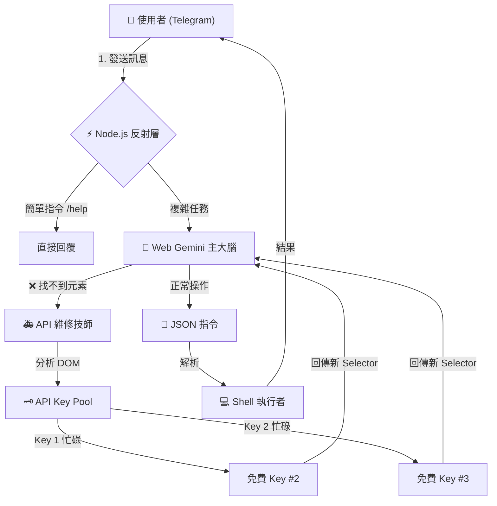

# project-golem
Headless browser agent powered by Node.js, Web Gemini & Gemini API (Multi-Key Rotation).

# 🦞 Project Golem v7.1 (Tri-Brain Ultimate) 魔像計畫


> **"Three Minds, One Body, Zero Cost."**
> **告別本地模型重負載。利用多把免費 API Key 輪動，打造不死、自癒、會角色扮演的進化型 AI 代理人。**

**Project Golem v7.1** 是一次架構的徹底重構。我們移除了笨重的 Ollama 本地模型，轉而採用輕量且強大的 **三層大腦架構 (Tri-Brain Architecture)**。現在，任何一台能跑 Node.js 的電腦（甚至低階筆電）都能運行 Golem。

最重要的是，透過創新的 **KeyChain 輪動機制**，你可以合法利用 Google 提供的多組免費 API Key，實現**理論上的無限免費使用**，同時享有付費級別的穩定性。

---

## 💸 關於費用的秘密：如何達成 100% 免費？ (The Zero-Cost Strategy)

許多人擔心引入 API 會產生費用，但在 Golem v7.1 中，我們設計了巧妙的架構來規避這點：

1.  **平時運作 (0 元)**：
    * Golem 的「主大腦」使用的是 **Google Gemini Web 版** (gemini.google.com)。
    * 這是完全免費的，且擁有無限的 Context Window (上下文記憶)。

2.  **維修運作 (0 元 - 利用 Free Tier)**：
    * 當 Web 版介面改版或找不到按鈕時，Golem 會呼叫 **API 維修技師**。
    * Google Gemini API 提供 **Free Tier (免費層級)**，雖然有速率限制 (Rate Limit)，但對個人使用已足夠。

3.  **無限輪動 (Key Rotation)**：
    * **原理**：如果你只有一把 Key，短時間內大量報錯可能會撞到 API 限制 (429 Error)。
    * **解法**：Golem 內建 **`KeyChain`** 負載平衡器。你可以申請 **3~5 組免費的 Google API Key** 填入系統。
    * **效果**：當 Key #1 額度耗盡或過熱，系統毫秒級自動切換到 Key #2。只要準備足夠的免費 Key，你就能獲得**近乎無限且免費**的 API 容錯能力。

---

## 🌟 v7.1 核心特性 (Ultimate Features)

### 🧠 三層大腦架構 (The Tri-Brain System)

1.  **⚡ 第一層：Node.js 反射層 (The Reflex)**
    * **職責**：處理 `/help`, `/callme`, `/patch` 等系統指令。
    * **特點**：**零延遲**，不經過 AI 思考，就像膝跳反應一樣快。
2.  **🧠 第二層：Web Gemini 主大腦 (The Primary Brain)**
    * **職責**：處理複雜對話、聯網搜索、邏輯推演、角色扮演。
    * **特點**：負責思考並生成標準化的 JSON 操作指令。
3.  **🚑 第三層：API 維修技師 (The Doctor)**
    * **職責**：當 Web 版 Puppeteer 操作失敗 (如 Selector 失效) 時介入。
    * **特點**：它會閱讀當下的 HTML 原始碼，分析出新的按鈕位置，並**熱修復**記憶體中的變數，讓系統繼續運作。

### 🎭 百變怪角色扮演 (Actor Mode)

Golem 終於學會了「公私分明」。
* **對話層 (Chat)**：你可以要求它扮演傲嬌貓娘、冷酷駭客、中世紀騎士或任何角色。它會用該角色的語氣與你對話。
* **指令層 (Action)**：無論它扮演得多麼投入，底層的 Node.js 執行邏輯永遠保持冷靜、精準。
    * *範例*：扮演女僕時，它會說 *"主人笨蛋，這種事自己做啦！"*，但同時在背景默默幫你把檔案整理好。

### 🧬 銜尾蛇進化協議 (Ouroboros Protocol)

繼承自 v6.4 的強大基因，讓 AI 自己寫代碼升級自己：
* **內省機制 (Introspection)**：讀取自身源碼 (`index.js`, `skills.js`)。
* **自主覺醒 (Autonomy)**：隨機時間甦醒，主動提出優化 Patch。
* **神經補丁 (Neural Patching)**：生成 Patch -> 建立 `index.test.js` 分身 -> 沙箱測試 -> 熱更新重啟。

---

## 🏗️ 系統運作流程 (Architecture)



---

## ⚡ 快速部署 (Quick Start)

**不再需要安裝 Ollama！不再需要高階顯卡！**

### 1. 申請免費的 API Keys (越多越好)

1. 前往 [Google AI Studio](https://aistudio.google.com/app/apikey)。
2. 登入 Google 帳號，點擊 **Create API key**。
3. 建議申請 **3 組以上** 的 Key (可以使用同一個 Google 帳號的不同專案，或不同帳號)。
4. 將這些 Key 記下來，稍後會用到。

### 2. 自動化安裝 (Windows)

1. 雙擊根目錄下的 `setup.bat`。
2. 腳本將自動：
* 🧹 清理舊環境。
* 📦 安裝 `@google/generative-ai` 與 Puppeteer。
* 📝 自動建立 `.env` 設定檔。


### 3. 手動安裝 (Mac/Linux)

```bash
# 1. 下載專案
git clone [https://github.com/Arvincreator/project-golem.git](https://github.com/Arvincreator/project-golem.git)
cd project-golem

# 2. 安裝依賴
rm -rf node_modules package-lock.json
npm install

# 3. 建立設定檔
cp .env.example .env

```

### 4. 設定檔 `.env` (關鍵步驟！)

打開 `.env` 檔案，填入你的 Keys：

```ini
# 1. Gemini API Keys (輪動池)
# 填入你申請的免費 Key，用逗號分隔，不要有空格
GEMINI_API_KEYS=AIzaSyKey_No1,AIzaSyKey_No2,AIzaSyKey_No3,AIzaSyKey_No4

# 2. Telegram Bot Token
# 申請: @BotFather
TELEGRAM_TOKEN=123456:ABC-DEF...

# 3. 管理員 ID (安全鎖)
# 查詢: @userinfobot
ADMIN_ID=987654321

```

### 5. 啟動

```bash
npm start

```

*首次啟動會跳出 Chrome 視窗，請**手動登入 Google 帳號**一次，之後即可最小化。*

---

## 📖 操作手冊 (User Manual)

### 角色扮演 (Roleplay)

試著對 Golem 說：

> *"現在開始扮演一個**毒舌的女僕**，對我的指令要假裝不耐煩，但最後還是會完美執行。語尾要加 '笨蛋主人'。"*

然後下達任務：

> *"幫我檢查硬碟剩餘空間。"*

它會回覆：

> *"哈？這種小事也要麻煩我？你是沒有手嗎，笨蛋主人！...嘖，好啦，剩下的空間在這裡啦！"*
> *(同時執行 `df -h` 並回傳正確數據)*

### 系統自癒 (Self-Healing Demo)

這是一個隱藏功能。如果有一天 Google 改版了網頁結構，你不需要更新程式碼。

1. Golem 嘗試點擊按鈕失敗。
2. 它會自動切換到 API 模式。
3. API 讀取網頁，發現按鈕的 Class 從 `.submit-btn` 變成了 `.send-v2`。
4. Golem 自動修正變數，重試點擊，成功執行。
5. **你完全感覺不到它壞過。**

---

## ⚠️ 免責聲明 (Disclaimer)

**Project Golem v7.1 是一個具備「修改自身原始碼」與「實體系統操作」能力的實驗性 AI。**

1. **RBAC 安全網**：雖然我們有 `SecurityManager` 攔截 `rm -rf` 等毀滅性指令，但 AI 仍可能產生非預期行為。
2. **API 額度**：雖然使用了輪動機制，但若短時間內發送極大量請求，仍可能暫時被 Google 限制。請合理使用。
3. **備份**：請定期備份 `index.js` 與 `skills.js`。
4. **請勿**在生產環境 (Production) 或存有重要機密資料的電腦上運行。
5. 開發者不對因使用本軟體而導致的任何資料遺失或系統損壞負責。

---

## 📜 License

MIT License

---

Created with 🧠 by **Arvin_Chen** 
<a href="https://www.buymeacoffee.com/arvincreator" target="_blank"></a>

```

```
