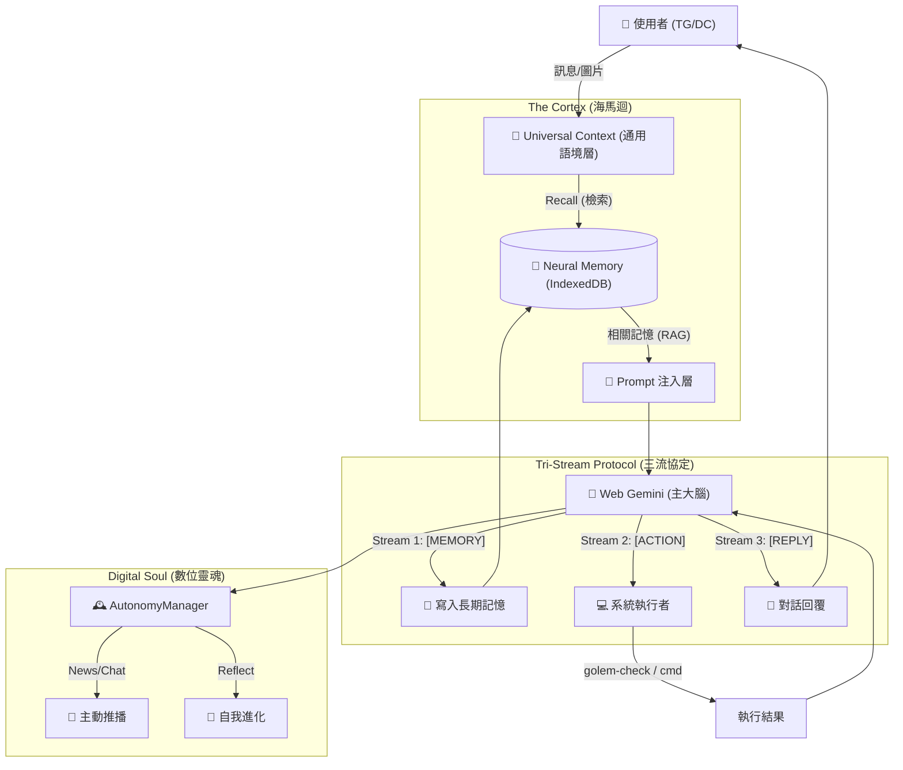

<a href="https://www.buymeacoffee.com/arvincreator" target="_blank"></a>

# project-golem

**Headless Browser Agent** powered by Node.js, Web Gemini & **Local Neural Memory**. Now featuring **Infinite Long-Term Memory (RAG)** & **Tri-Stream Protocol**.

# 🦞 Project Golem v8.0 (Neural Memory Edition) 魔像計畫

> **"I remember, therefore I serve."**
> **不僅是環境感知的代理人，更是擁有「無限記憶」的數位伴侶。搭載本地海馬迴，讓每一段對話都成為永恆。**

受 clawdbot/moltbot/openclaw 啟發，Project Golem 是一個基於 Puppeteer 控制 Web Gemini 的本機 AI 代理人。

**Project Golem v8.0** 🦞 代表了從「短期互動」到「長期陪伴」的終極進化：
除了繼承 v7.6 的 **自動探測 (Auto-Discovery)** 與 **視神經 (OpticNerve)**，v8.0 引入了震撼的 **「神經海馬迴 (Neural Cortex)」**。
利用 **Transformers.js** 與 **IndexedDB**，Golem 現在能在您的瀏覽器背景建立一個**本地向量資料庫**。它能記住您的喜好、習慣與過往對話，並在適當的時候「想起來」——完全**離線運行**，無需昂貴的向量雲端服務。

同時，為了處理這種複雜思維，我們實裝了 **「三匯流協定 (Tri-Stream Protocol)」**，讓 Golem 能在一次思考中同時處理「記憶寫入」、「外部行動」與「對話回覆」。

---

## 🏗️ 系統架構深度解析 (System Architecture)

Golem v8.0 運作於四大支柱：**反射神經**、**認知大腦**、**感知執行** 與 **深層記憶**。

### 1. 數據流向圖 (Data Flow)



### 2. 核心模組大全 (All Core Modules)

#### 🐘 Neural Memory (神經海馬迴) [v8.0 Core]

* **技術核心**：利用 `Transformers.js` (all-MiniLM-L6-v2) 在本地瀏覽器中執行 Embedding 運算。
* **零成本 RAG**：完全不依賴 OpenAI 或 Pinecone。所有記憶儲存於您本機 Chrome 的 `IndexedDB` 中，永久保存且隱私安全。
* **沉默記憶 (Silent Imprint)**：Golem 會自動判斷對話中的重要資訊（如「我不吃辣」），並默默寫入記憶，不需要您刻意下指令。

#### ⚓ Tri-Stream Anchors (三匯流協定) [v8.0 New]

* **多工思維**：強制 Gemini 輸出特定格式，將單次回應拆解為三條平行串流：
1. `[🧠 MEMORY_IMPRINT]`: 給海馬迴看的筆記。
2. `[🤖 ACTION_PLAN]`: 給 Node.js 執行的指令。
3. `[💬 REPLY]`: 給人類看的對話。


#### 🧠 Golem Brain (Web Gemini)

* **無限文本 (Infinite Context)**：利用 Web 版 Gemini 的長文本優勢，結合本地 RAG，實現理論上的無限記憶長度。
* **自癒機制 (DOM Doctor)**：當 Puppeteer 失效時，自動調用 Gemini API 修復 CSS Selector。

#### 🔍 ToolScanner (環境感知器) [v7.6]

* **主動探測**：執行未知指令前，先用 `golem-check` 確認環境（如 ffmpeg, python, git），避免盲目報錯。

#### 🔮 OpticNerve (視神經) [v7.6]

* **視覺理解**：整合 Gemini 2.5 Flash API。當您傳送圖片或文件時，Golem 能「看見」並進行分析，甚至能讀懂程式碼截圖。

#### 🕰️ AutonomyManager (自主靈魂)

* **自由意志**：擁有隨機的甦醒時間與作息。它會主動上網看新聞、根據記憶找話題聊天，或自我優化代碼。

---

## 💸 關於費用的秘密：如何達成 100% 免費？ (The Zero-Cost Strategy)

**v8.0 依然保持 100% 免費神話，甚至更進一步：**

1. **大腦 (Generation)**：使用 **Google Gemini Web** (免費)。
2. **記憶 (Embedding)**：使用 **Transformers.js** (本地 CPU 運算，免費)。
3. **儲存 (Vector DB)**：使用 **IndexedDB** (本機硬碟，免費)。
4. **視覺 (Vision)**：使用 **Gemini API Free Tier** (免費)。
5. **無限輪動 (Key Rotation)**：內建 `KeyChain`，支援多組 API Key 自動切換，突破速率限制。

---

## ⚡ 快速部署 (Quick Start)

### 1. 準備必要 Token

1. **Google Gemini API Key** (必備)：[Google AI Studio](https://aistudio.google.com/app/apikey) 申請 (Free Tier 即可)。
2. **Telegram/Discord Token** (選填)。

### 2. 下載原始碼

```bash
git clone https://github.com/Arvincreator/project-golem.git
cd project-golem

```

### 3. 自動化安裝 (v8.0)

* **Windows**: 雙擊 `setup.bat` (會自動檢查 `memory.html` 是否存在)。
* **Mac / Linux**:

```bash
chmod +x setup.sh
./setup.sh

```

* **注意**：首次啟動時，系統會自動下載約 **50MB** 的 AI 模型到本地快取，請耐心等候。

### 4. 設定檔 `.env`

```ini
GEMINI_API_KEYS=你的Key1,你的Key2
TELEGRAM_TOKEN=123...
DISCORD_TOKEN=MTE...
# v8.0 Update: 不需要 HuggingFace Token

```

### 5. 啟動

```bash
node index.js

```

*(看到 `📡 Golem v8.0 (Neural Memory) is Online` 即代表海馬迴已上線)*

---

## 📖 生活化情境展示 (Daily Life with v8.0)

### 1. 跨越時間的記憶 (The Long-Term Memory)

*(兩個月前，你隨口提了一句...)*

> **User**: "我喝咖啡只喝燕麥奶拿鐵，千萬別加糖，會過敏。"
> **Golem (v8.0)**: "好的，記住了。" *(默默寫入向量資料庫)*

*(兩個月後，Golem 也重啟了無數次...)*

> **User**: "幫我查一下星巴克有沒有我想喝的那種咖啡，有的話多少錢。"
> **Golem**: *(觸發 RAG 檢索 -> 發現「燕麥奶/無糖/過敏」記憶)*
> "早安！幫你查到了，星巴克有提供 **燕麥奶拿鐵** 喔。
> 大杯價格約 $160，我也確認過可以做 **完全無糖**，不用擔心過敏問題！要幫你找附近的店嗎？"

### 2. 複雜任務的多工處理 (Tri-Stream Processing)

*(你想知道天氣並要求它記住你的穿衣風格)*

> **User**: "今天好冷喔幾度啊？記住我喜歡穿休閒一點的衣服，以後給我建議時參考一下。"
> **Golem**:
> *(Stream 1 [MEMORY]): 寫入「使用者偏好休閒風格穿搭」。*
> *(Stream 2 [ACTION]): 執行 `golem-check weather` 查詢氣溫。*
> *(Stream 3 [REPLY]): "收到！正在幫你查氣溫，我也把你的穿衣風格記在腦海裡了！"*

### 3. 視覺與探測的結合 (Vision + Discovery)

*(你傳了一張 Python 錯誤截圖)*

> **User**: [圖片] "這要怎麼修？"
> **Golem**: *(OpticNerve 分析圖片 -> 發現是 `ModuleNotFoundError: pandas`)*
> "這看起來是缺少 `pandas` 套件。稍等，我檢查一下你的環境..."
> *(Auto-Discovery: 執行 `golem-check pip`)*
> "確認你已安裝 pip。請執行以下指令來修復：`pip install pandas`。要我幫你執行嗎？"

---

## ⚠️ 免責聲明 (Disclaimer)

**Project Golem v8.0 是一個具備「長期記憶」與「實體操作」能力的 AI 代理人。**

1. **記憶隱私**：所有的對話記憶與向量數據皆儲存於**您本機的 User Data Dir**，不會上傳至任何第三方向量雲端。
2. **自主行為**：Golem 會根據記憶主動發起話題，請勿感到驚慌。
3. **資料安全**：請勿讓 Golem 記憶您的密碼或信用卡號 (雖然它在本地，但明文儲存仍有風險)。
4. **請勿**在生產環境 (Production) 運行。

---

## 📜 License

MIT License

---

Created with Gemini by **Arvin_Chen**
<a href="https://www.buymeacoffee.com/arvincreator" target="_blank"></a>
