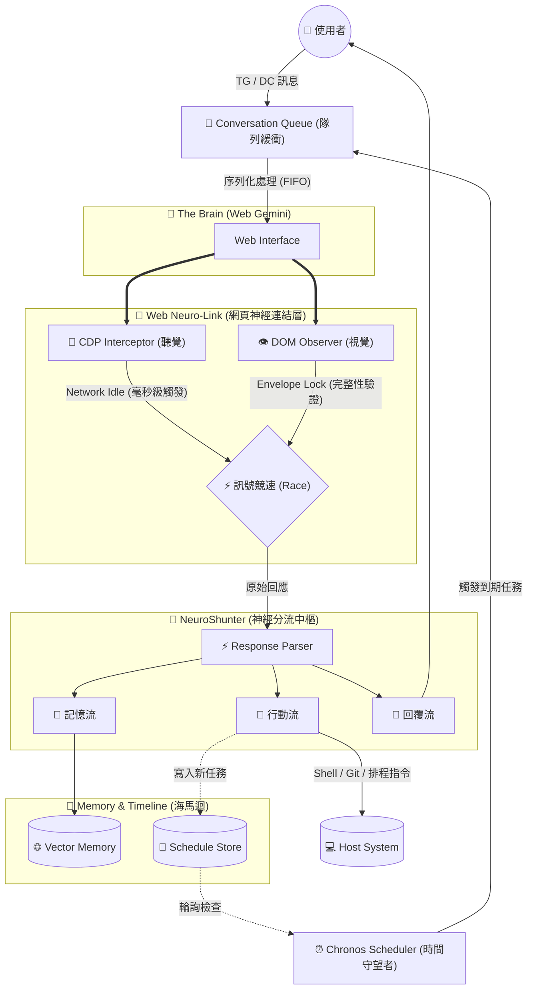

<a href="https://www.buymeacoffee.com/arvincreator" target="_blank"></a>


# 🦞 Project Golem v8.6 (Titan Chronos Edition)

---

* 架構：[Universal Context] -> [🚦 對話隊列 & ⏰ 時序排程] -> [NeuroShunter] <==> [Web Gemini]
* 核心升級：
* 1. 🚦 **Titan Queue (泰坦隊列)**: 實作 FIFO 對話緩衝區與防抖機制 (Debounce)，徹底解決網頁版單執行緒的並發衝突。


* 2. ⏰ **Chronos Timekeeper (時間領主)**: 新增時間軸感知與任務輪詢系統，支援跨時段任務排程 (IndexedDB 持久化)。


* 3. 🛡️ **Titan Protocol**: 強制三流協定 (Memory/Action/Reply)，移除 Emoji 降低解析干擾，提升指令遵從度。


* 4. 🥪 **Envelope Lock**: 強化版「三明治信封」鎖定 ([[BEGIN]]...[[END]])，確保長文本輸出的完整性。


---

* 原有特性保留：
* 🐍 Hydra Link | 🧠 Tri-Brain | ☁️ OTA Upgrader | 👁️ Agentic Grazer
* 💰 Sponsor Core | 🔍 Auto-Discovery | 🔮 OpticNerve | ⚡ Neuro-Link (CDP)
*/

> **"I perceive, therefore I act. I plan, therefore I am."**
> **搭載「時序感知 (Chronos)」與「網頁神經連結 (Neuro-Link)」的完全自律型 AI 代理人。**
> **結合對話隊列管理、本地持久化排程與自動 Git 版控，實現真正意義上的「7x24 小時 AI 助理」。**

Project Golem 是一個基於 Puppeteer 控制 Web Gemini 的本機 AI Agent。
**v8.6 版本** 引入了 **Titan Queue 架構**，解決了傳統網頁自動化無法處理多人/多工並發的痛點，並賦予 AI **「時間觀念」**，讓它能主動在未來執行任務，不再只是被動回應。

---

## 🏗️ 系統架構深度解析 (System Architecture)

Golem v8.6 在大腦前額葉增加了一個 **流量控制層 (Conversation Manager)**。所有來自使用者或系統內部的訊號，都必須經過隊列整流，確保 Gemini 的思緒清晰且單一。



---

## 📊 戰術控制台 (Tactical Dashboard) `v8.6 Updated`

v8.6 儀表板新增了 **[時序雷達]** 與 **[隊列監控]**，讓您即時掌握 AI 是否忙碌以及未來的行程。

```text
┌─ ⚡ System Core (CPU/RAM) ─────────┐┌─ 📊 Status (v8.6) ─────────────┐
│ CPU: [||||||       ] 12%          ││ Mode: Browser (Chronos)        │
│ RAM: [||||||||||   ] 145 MB       ││ Queue: 🟢 Idle                 │
└────────────────────────────────────┘│ Schedule: 1 task pending       │
┌─ ⏰ Chronos Radar (Scheduled Tasks) └─────────────────────────────────┐
│ [10:23:41] 📅 [Chronos] 新增排程: "提醒開會" @ 2026-02-12T09:00:00Z   │
│ [10:24:00] ⏳ [TimeWatcher] 掃描中... (無到期任務)                    │
└───────────────────────────────────────────────────────────────────────┘
┌─ 🚦 Traffic Control (Queue Monitor) ──────────────────────────────────┐
│ [10:23:42] ⏳ [Queue] 收到片段: "幫我查..." (Buffering)               │
│ [10:23:43] 📦 [Queue] 封包完成，加入隊列 (1 waiting)                  │
│ [10:23:44] 🚀 [Queue] 開始處理訊息... (Processing)                    │
└───────────────────────────────────────────────────────────────────────┘
┌─ 📝 Neuro-Link Stream ────────────────────────────────────────────────┐
│ [10:23:45] ✅ [CDP] 網路傳輸完畢 (Winner: Network)                    │
│ [10:23:46] 💬 [回覆] 已為您設定好明天的提醒。                         │
└───────────────────────────────────────────────────────────────────────┘

```

---

## 🚀 v8.6 核心功能 (Core Features)

### 🚦 Titan Queue (泰坦隊列系統) `v8.6 NEW`

* **防抖動機制 (Debounce)**：使用者分段傳送的訊息（如：「幫我」「查一下」「天氣」），會被自動合併為單一完整的思考請求，避免 AI 產生碎片化回應。
* **單行道管控**：確保在 Web Automation 正在操作 DOM 時，新的請求會乖乖排隊，防止瀏覽器上下文衝突導致的崩潰。

* ⚠️ 注意：此功能僅支援 Browser Memory 模式。若使用 QMD (System) 模式，排程功能將自動停用。

### ⏰ Chronos Timekeeper (時間領主) `v8.6 NEW`

* **時間軸感知**：Golem 現在能理解「明天」、「下週」或「30分鐘後」的概念。
* **持久化排程**：任務儲存於瀏覽器端的 IndexedDB。即使 Golem 重啟，已預約的任務也不會消失。
* **主動喚醒**：時間一到，Golem 會自動從背景醒來，主動向使用者發送訊息或執行腳本。

* ⚠️ 注意：此功能僅支援 Browser Memory 模式。若使用 QMD (System) 模式，排程功能將自動停用。

### ⚡ Web Neuro-Link (網頁神經連結) `核心`

* **雙軌並行監聽**：同時監聽 CDP Network 封包與 DOM 變化。
* **三明治信封鎖 (Envelope Lock)**：透過注入隨機 ID 標籤 (`[[BEGIN:xyz]]...[[END:xyz]]`)，確保截取到的 AI 回應絕對完整，解決網頁版生成過慢導致的截斷問題。

### 🐙 Git Master (版本控制大師)

* **全自動版控**：Golem 能自主執行 `git init`, `add`, `commit`, `push` 等操作。
* **環境感知**：操作前自動檢查 `.gitignore` 與 Remote 狀態，避免發生災難性覆蓋。

### 👁️ OpticNerve (視神經)

* **多模態視覺**：整合 **Gemini 2.5 Flash** API。直接將圖片、PDF 文件傳給 Golem，它能進行深度解析、代碼除錯、UI 結構分析，甚至讀懂梗圖。

### ⚓ Tri-Stream Protocol (三流協定)

* **多工處理**：將單次思考拆解為「記憶寫入」、「外部行動」、「對話回覆」三條平行串流。Golem 能在聊天的同時，默默將重要資訊寫入筆記，並在背景執行 Shell 指令。

---

## ⚡ 快速部署 (Quick Deployment)

我們提供了一鍵安裝腳本，自動完成環境檢測、依賴安裝與記憶模式設定。

### 1. 獲取 Token

* **Gemini API Key** (必備): [Google AI Studio](https://aistudio.google.com/app/apikey)
* **Telegram token (必填）  / Discord Token** (選填)

### 2. 下載專案

```bash
git clone https://github.com/Arvincreator/project-golem.git
cd project-golem

```

### 3. 一鍵安裝 (自動化)

此腳本會自動安裝 Node.js (若無)、`blessed` 儀表板套件，並建立 `.env` 設定檔。

* **Mac / Linux**:

```bash
chmod +x setup.sh
./setup.sh

```

* **Windows**:
直接雙擊執行 `setup.bat` 即可。

> **注意**：若您的電腦尚未安裝 Node.js，腳本會自動幫您下載安裝。安裝完成後，請**關閉視窗並再次執行 setup.bat** 以完成後續設定。

### 4. 啟動 Golem

* **標準模式** (背景執行):

```bash
npm start

```

* **戰術控制台模式** (推薦，含視覺化儀表板):

```bash
npm start dashboard

```

*(按 `F12` 可將介面分離 Detach，讓程式繼續在背景運作)*

* **Web UI (v8.6 New)**:
  啟動 Dashboard 後，可透過瀏覽器訪問：[http://localhost:3000](http://localhost:3000)
  (包含即時狀態、排程監控與系統日誌)

---

## 📖 生活化情境展示

### 1. 時間管理 (Chronos Schedule) `v8.6`

> **User**: "提醒我明天早上 9 點要開會，另外幫我把這份文件 push 到 GitHub。"
> **Golem**: "沒問題。
> 1. 已執行 Git Push 操作。
> 2. 已設定排程：**2026-02-12 09:00:00** 提醒您「會議開始」。"
> *(...隔天早上 9 點...)*
> **Golem (主動發訊)**: "⏰ 提醒：現在是 9 點，您的會議要開始囉！"
> 
> 

### 2. 視覺除錯 (OpticNerve)

*(使用者上傳一張 Server 報錯的截圖)*

> **Golem**: *(透過 Gemini 2.5 Flash 分析截圖中的 Error Log)*
> "偵測到 `EADDRINUSE: port 3000` 錯誤。這表示 Port 3000 被佔用了。
> 我可以執行 `lsof -i :3000` 幫你找出是哪個 Process 佔用，或者直接幫你殺掉它嗎？"

---

## ⚠️ 免責聲明 (Disclaimer)

1. **自行承擔風險**：本軟體擁有執行 Shell 指令的高級權限，請謹慎授權高風險操作（如 `rm`, `Format`）。
2. **帳號安全**：建議使用 **分身 Google 帳號 (Burner Account)** 來運行 Golem，以避免因自動化操作導致主帳號風險。
3. **隱私聲明**：所有的長期記憶與向量資料皆儲存於您的 **本機設備**，開發者無法存取。

---

Created with Gemini by **Arvin_Chen**
<a href="https://www.buymeacoffee.com/arvincreator" target="_blank"></a>
